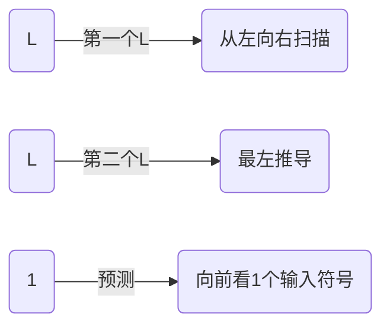
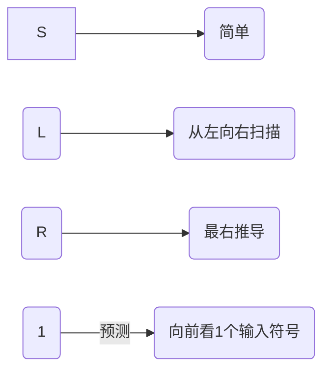

# Compiler_MYSQL_HOMEWORKs

[TOC]

## 说明

简单的MYSQL编译器实现。觉得对学习编译原理有用的话，就给个start吧！


## 工作流

按照MYSQL语法准备实现一个简单可执行的编译器。
主要工作流程
- [x] 词法分析
  - [x] create
  - [x] show
  - [x] drop
  - [x] use
  - [x] insert
  - [x] select
  - [x] update
  - [x] delete
- [x] 语法分析
  - [x] create
  - [x] show
  - [x] drop
  - [x] use
  - [x] insert
  - [x] select
  - [x] update
  - [x] delete
- [ ] 语法制导翻译
  - [x] create

  - [x] show

  - [x] drop

  - [x] use

  - [x] insert

  - [x] select

  - [ ] update

  - [ ] delete

    

## 笔记

参考链接：https://www.jianshu.com/u/53b3f4658edc

### 消除左递归

#### 左递归的分类

- 直接左递归：P → Pa
- 简介左递归：P → Aa， A → …… → Pb

#### 直接左递归的消除

- 对于 P  →  Pa | b 形式(b可为空)，可以知道，推导结束的时候一定有一个b在最开始位置（如ba），后面是无数多个a，所以可以归纳得出如下的消除方法

```
P  →  bP';
P'  →  aP' | ε;
```

- 更一般化的形如P  →  PX|Y（其中X和Y看作一个整体，比如：P  → Pabc|ab|b，X就是abc，Y就是ab|b），可以归纳成如下形式：

```
P  →  YP';        比如：P  →  abP' | b P'
P'  →  XP' | ε;   比如： P'  →  abcP' | ε
```

#### 间接左递归的消除

- 对于P  →  Aa | x1， A  →  ……  →  Pb | x2的形式
- 消除规则
  - 1） 若消除过程中出现了直接左递归，就按照直接左递归的方法，来消除
  - 2） 若产生式右部最左的符号是非终结符，且这个非终结符序号大于等于左部非终结符，则暂不处理（后面会处理到）
  - 3） 若序号小于左部的非终结符，则用之前求到的式子的右部来替换

 

####  例题

- 存在如下文法，消除左递归
   1）S  →  Qc | c
   2）Q  →  Rb | b
   3）R  →  Sa | a

1）把文法G的所有非终结符按任意顺序排列，并编号

```
R、Q、S
```

2）按上面的排列顺序，对这些非终结符进行遍历
 3）将当前处理的非终结符中的序号小于等于它的非终结符按规则3）进行替换（序号大于的按规则2）处理）

```
R:
R的右部中的非终结符有S;
S的下标大于R，可以暂时不处理;
所以此时R改写为：R  →  Sa | a

----------------------------------------------
Q:
Q的右部中的非终结符有R;
R的下标小于Q，将R的右部替换进来;
所以此时Q改写为：Q  →  Sab | ab | b;
S的下标大于Q，可以暂时不处理;
所以此时Q改写为：Q  →  Sab | ab | b;

-----------------------------------------
S:
S的右部中的非终结符有Q;
Q的下标小于S，将Q的右部替换进来;
所以此时S改写为：S  →  Sabc |abc | bc | c
S的下标等于S，可以暂时不处理;
所以此时S改写为：S  →  Sabc |abc | bc | c
```

4）消除i序号的非终结符的直接左递归（如果存在的话）

```
S  →  Sabc |abc | bc | c
∴  X = abc，Y = abc | bc | c
∴ 直接消除左递归的结果是：
S  →  abcS' | bcS' | cS'
S'  → abcS' | ε
```

5）删除其中不可达的非终结符，这里就是Q、R了

∴ 最终消除左递归的结果是

```
S  →  abcS' | bcS' | cS'
S'  → abcS' | ε
```

 

 

 

 

 

 

 

 


### 提取最左因子

#### 提取办法

- 很简单，比如 A  →  δβ1 | δβ2 | δβ3 | …… |δβn | δ，就提取成
   A  →  δA'
   A'  →   β1 | β2 | β3 | …… | βn | ε
   重复这个操作，直到所有的FIRST集合两两不相交

#### 注意

- 这样做是有一定代价的，会引入大量的非终结符和ε，增加了语法分析的难度

 

 

 

 

 

### 求First集合

#### 计算FIRST集合步骤

- 求解FIRST(X)
- 1）若X ∈ VT，则FIRST(X) = {X}。【终结符自己就是自己的FIRST集合】
- 2）若X ∈ VN，且有产生式X → a……， a ∈ VT，则a ∈ FIRST(X) 【非终结符，选第一个终结符加入】
- 3）若X ∈ VN，X → ε，则 ε ∈ FIRST(X) 【能直接推出ε，ε加入FIRST】
- 4）若X,Y1,Y2,……,Yn ∈ VN，而有产生式X → Y1,Y2,……,Yn。当Y1,Y2,……,Y(i-1) 直接推出ε时，则FIRST(Y1) - ε, FIRST(Y2) - ε, …… , FIRST(Y(i-1) - ε) ,FIRST(Yi) 都包含在FIRST(X)中【中间的ε是不会加入进去的】
- 5）当4）中所有Yi 都推出 ε时，则最后的FIRST(X) = FIRST(Y1) ∪ FIRST(Y2) ∪ …… ∪ FIRST(Yn) ∪ {ε}

反复运用2）-5）步骤，直到每个符号的FIRST集合不再增大为止


### 求FOLLOW集合

#### 计算FOLLOW集合步骤

- 求解非终结符A的随符集FOLLOW(A)
- 1）对S，将 # 加入 FOLLOW(S)，然后再按后面的处理
- 2）若B → αAβ是G的产生式，则将FIRST(β) - ε 加入FOLLOW(A)
- 3）若B → αA是G的产生式，或B → αAβ是G的产生式（β 多次推导后得到ε ），则将FOLLOW(B) 加入到FOLLOW(A) 【因为把B用αA替换之后，B后面紧跟的字符就是A后面紧跟的字符】
- 4）反复使用2）-3），直到FOLLOW集合不再增大为止
- 注意
  - 这里的文法G必须是消除左递归且提取了左因子（点击查看提取左因子的办法）


### 求SELECT集合

#### 方法

- 首先，得会求解[FIRST集合](https://www.jianshu.com/p/854fceaff8bd)和[FOLLOW集合](https://www.jianshu.com/p/8cd08fadc97b)（可点击查看）
- 求解方法：
   1.如果 α 不能推出 ε，则：SELECT(A  →  α) = FIRST(α)
   2.如果 α 推出 ε，则：SELECT(A  →  α) = ( FIRST(α) – {ε} ) ∪ FOLLOW(A)


### 求预测分析表

#### 预测分析程序的算法（栈顶为X，读入头下为a）

- 1）X = a = '#'：识别成功，推出分析程序（X为终结符）
- 2）X = a ≠ '#'：进行匹配，弹出X，读头后移（X为终结符）
- 3）X ≠ a：进行error处理（X是终结符）
- 4）若X是非终结符，则查询预测分析表M，若M[X,a]中有关于X的产生式，则弹出X，将产生式入栈；如果M[X,a]中是出错标志，则error处理

####  预测分析表具体步骤

- 步骤
  - 1）求出所有非终结符的FIRST集合，FOLLOW集合
  - 2）求出所有产生式的SELECT集合
  - 3）按规则填预测分析表
- 填表规则
  - 根据FIRST集合，看该位置是填候选式还是出错标志（输入符号不存在于FIRST集合中，就是出错标志）
  - 若要填候选式，根据SELECT集合的元素对应填写候选式

 

###  LL(1)文法



判断一个文法是不是LL(1)文法

- 当且仅当对于G的每个非终结符A的任何两个产生式A → α | β，有：

- ```
  // 消除左递归，提取最左公因子的情况下
  1）FIRST(α) ∩ FIRST(β) = ∅
  2）若ε ∈ FIRST(β)，则FIRST(α) ∩ FOLLOW(A) = ∅
  ```

- 注意

  - LL(1)文法没有二义性，有二义性的文法一定不是LL(1)文法
  - LL(1)文法是上下文无关文法的一个子集

  


### SLR(1)文法




#### 作用

因为SLR文法分析法就是对LR(0)的一种优化，它提供了一种解决冲突的方法，所以很多之前在LR(0)提及的东西，在此只提供一个引用。 
LR(0)文法分析法

#### 算法描述

SLR文法构造分析表的主要思想是：许多冲突性的动作都可能通过考察有关非终结符的FOLLOW集而获解决。 
解决冲突的方法：解决冲突的方法是分析所有含A和B的句型，考察集合FOLLOW(A)和FOLLOW(B)，如果这两个集合不相交，而且也不包含b，那么当状态I面临输入符号a时，我们可以使用如下策略：

若a=b，则移进。
若a∈FOLLOW(A)，则用产生式A→α进行归约；
若a∈FOLLOW(B)，则用产生式B→α进行归约；
此外，报错*
SLR的基本算法：

假定LR(0)规范族的一个项目集I中含有m个移进项目 
A1→α•a1β1，A2→α•a2β2，…，Am→α•amβm； 
同时含有n个归约项目 
B1→α•，B2→α•，…，B3→α•，
如果集合{ a1,…, am}，FOLLOW(B1)，…，FOLLOW(Bn)两两不相交（包括不得有两个FOLLOW集合有#），则隐含在I中的动作冲突可以通过检查现行输入符号a属于上述n+1个集合中的哪个集合而活的解决：
若a是某个ai，i=1,2,…,m，则移进。
若a∈FOLLOW(Bi)，i=1,2,…,m，则用产生式Bi→α进行归约；
此外，报错
这种冲突的解决方法叫做SLR(1)解决办法。

#### SLR语法分析表的构造方法： 

首先把G拓广为G’，对G’构造LR(0)项目集规范族C和活前缀识别自动机的状态转换函数GO。函数ACTION和GOTO可按如下方法构造：

若项目A→α•bβ属于Ik，GO(Ik,a)= Ij,a为终结符，置ACTION[k,a]为“把状态j和符号a移进栈”，简记为“sj”；
若项目A→α•属于Ik，那么，对任何非终结符a，a∈FOLLOW(A)，置ACTION[k,a]为“用产生式A→α进行归约”，简记为“rj”；其中，假定A→α为文法G’的第j个产生式
若项目S’→S•属于Ik，则置ACTION[k,#]为可“接受”，简记为“acc”；
若GO(Ik, A)= Ij，A为非终结符，则置GOTO[k, A]=j；
分析表中凡不能用规则1至4填入信息的空白格均填上“出错标志”。 
语法分析器的初始状态是包含S’ →•S的项目集合的状态 
SLR解决的冲突只是移进-规约冲突和规约-规约冲突


